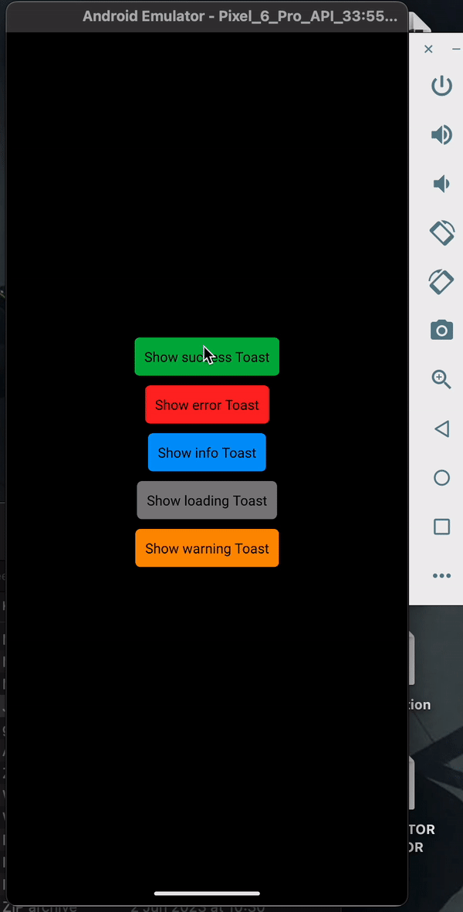

# @pakenfit/toast-it

Let's toast to the health of your application

<p align='center' style="display: flex">
  
  
</p>


## Installation

```sh
npm install @pakenfit/toast-it --save
```

<p align="center">Or</p>

```sh
yarn add @pakenfit/toast-it
```

#### Dependencies
This library needs these dependencies to be installed in your project before you can use it:

```sh
npm install react-native-gesture-handler react-native-reanimated react-native-safe-area-context --save
```
<p align="center">Or</p>

```sh
yarn add react-native-gesture-handler react-native-reanimated react-native-safe-area-context
```

## Features

- Fully customizable
- Works on `Android` and `iOS` (not tested on `web` should work as well)
- Compatible with Expo
- Written in Typescript


## Usage

```js
import { Toast, useToast } from '@pakenfit/toast-it';

export default function App() {
  const { toastRef, show } = useToast();

  return (
    <SafeAreaProvider>
      <View style={styles.container}>
        <Toast
          ref={toastRef}
          defaultConfig={{
            textNumberOfLines: 2,
            bgColor: 'white',
            textColor: 'black',
          }}
        />
        <Button
          label='Show Toast'
          onPress={() =>
            show({
              type: 'success',
              message: 'This is a success Toast🤙🏽',
            })
          }
        />
      </View>
    </SafeAreaProvider>
  )
}


```

## Configuration
The toast component accepts the following configuration options:

- `type (optional)`: The type of the toast message. Possible values are `'success'`, `'error'`, `'warning'`, `'info'`, or `'loading'`. Default is `'info'`.
- `message`: The text message to be displayed in the toast.
- `duration (optional)`: The duration of the toast message in milliseconds. Use `'infinite'` for an indefinite duration. Default is `3000` milliseconds.
- `bgColor (optional)`: The background color of the toast. Default is white.
- `textColor (optional)`: The text color of the toast message. Default is `black`.
- `iconColor (optional)`: The color of the toast icon. Default is undefined (uses default color for each type).
- `iconSize (optional)`: The size of the toast icon. Default is undefined (uses default size for each type).
- `textNumberOfLines (optional)`: The number of lines to display for the toast message. Default is `1`.


## API
The Toast component provides the following methods through the toastRef:

- `show(config: toastConfig)`: Displays a toast message with the specified configuration.
- `hide()`: Hides the currently displayed toast message.
- `isVisible()`: Returns a boolean indicating whether a toast message is currently visible.


## Contributing

See the [contributing guide](CONTRIBUTING.md) to learn how to contribute to the repository and the development workflow.

## Development

You can launch the example app to test your feature or bug:

```sh
yarn example ios

or

yarn example android
```

Run tests

```
yarn test
```

## License

MIT

---

Made with [create-react-native-library](https://github.com/callstack/react-native-builder-bob)

Inspired by [react-hot-toast](https://github.com/timolins/react-hot-toast)
